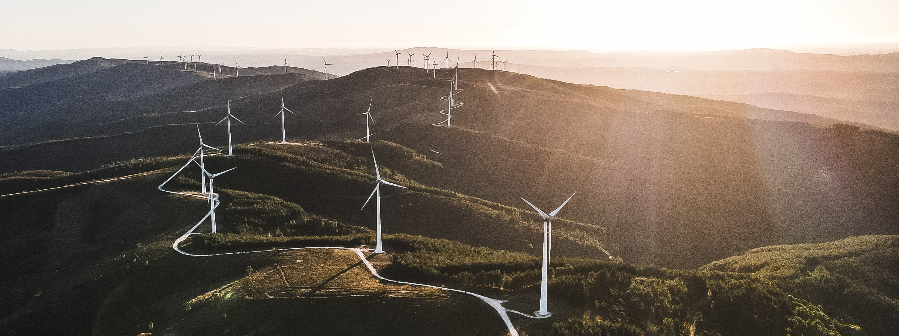

[Return to Homepage](https://mathiassteilen.github.io/)

[Return to Statistical Modelling Section](https://mathiassteilen.github.io/modelling.html)



```{r setup, include=FALSE}
knitr::opts_chunk$set(echo = TRUE)

library(tidyverse)
```

***
### Description of the Data
***

The [data](https://github.com/rfordatascience/tidytuesday/tree/master/data/2018/2018-11-06) comes from the [Tidy Tuesday](https://github.com/rfordatascience/tidytuesday) project launched by R for Data Science team. It covers 1,479 wind energy projects in the United States over a period from 1981 to 2018.


***
### Template
***

```{r, echo=FALSE, message=FALSE, warning=FALSE}
# Load data
wind <- read.csv("C:/Users/mathi/OneDrive/Universitaet/6th semester/Data Visualisation/4 - Portfolio/Data/us_wind.csv") %>% as_tibble()
```

Other than the replacement of missing values and the categorisation of all projects into decades, there was not much to be done data cleaning wise.

Data Preparation (click to unfold code):

```{r}
wind <- wind %>% 
  mutate(across(everything(), ~replace(., . ==  "missing" , NA))) %>%
  mutate(across(everything(), ~replace(., . ==  -9999 , NA))) %>%
  select(p_name, p_cap, xlong, ylat, p_year) %>% 
  group_by(p_name) %>% 
  slice(1) %>% 
  ungroup() %>% 
  drop_na() %>% 
  mutate(p_year = cut(p_year, seq(1980, 2020, 10), dig.lab = 5)) %>% 
  filter(dplyr::between(xlong, -125, -65),
         dplyr::between(ylat, 20, 50)) %>% 
  distinct()
```

Plot (click to unfold code):

```{r, fig.width = 8, fig.height=4.95, dpi=300, dev="png"}
us <- map_data('state')

wind %>%
  ggplot(aes(x = xlong, y = ylat)) +
  geom_polygon(data = us, aes(x = long, y = lat, group = group),
               color = 'gray', fill = "gray95", alpha = 0.3) +
  geom_point(aes(size = p_cap, colour = p_year), alpha = 0.25, shape = 19) +
  scale_size_continuous(range = c(0.5, 4), 
                        labels = scales::comma_format(suffix = " MW")) +
  xlim(-125, -65) + 
  ylim(20, 50) +
  labs(title = "Wind Energy Infrastructure in the USA",
       subtitle = "Each dot constitutes one completed wind farm with size representing production capacity",
       y = NULL,
       x = NULL,
       size = "Project Capacity:",
       colour = "Period of Construction:") +
  theme_minimal() +
  # coord_fixed() +
  theme(panel.background = element_blank(),
        panel.grid = element_blank(),
        axis.ticks = element_blank(),
        axis.line = element_blank(),
        axis.text = element_blank(),
        plot.title = element_text(size = 12, face="bold", colour="black"),
        plot.subtitle = element_text(face = "italic", colour = "gray50")) +
  scale_colour_manual(values = c("firebrick", "darkorange",
                                 "dodgerblue4", "dodgerblue"))
```


&nbsp;
<hr />
<p style="text-align: center;">A work by <a href="https://www.linkedin.com/in/mathias-steilen/">Mathias Steilen</a></p>
&nbsp;