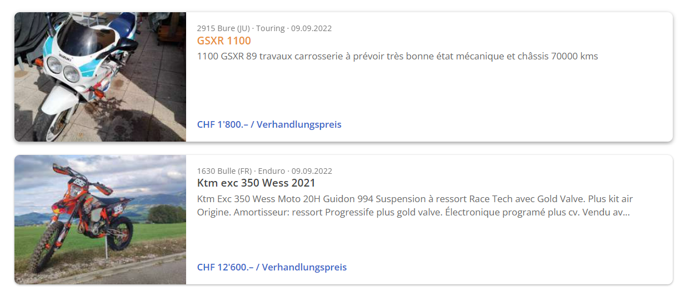

[Return to Homepage](https://mathiassteilen.github.io/)

[Return to Machine Learning Section](https://mathiassteilen.github.io/modelling.html)


<style>
body {
text-align: justify}
</style>

```{css, echo=FALSE}
pre, code {white-space:pre !important; overflow-x:auto}
```

```{r setup, include=FALSE}
knitr::opts_chunk$set(echo = TRUE, warning = FALSE)

library(tidyverse)
library(broom)
library(readxl)
library(lubridate)
library(patchwork)
library(rvest)
library(httr)
library(tidymodels)
library(tidytext)
library(textrecipes)
library(vip)
library(doParallel)
```

***
### Description of the Data
***

This blog post is about how to create your own data sets by scraping websites with _rvest_. Specifically, I will scrape all available used motorcycles from the online platform [Anibis](https://www.anibis.ch), explore the data, make conclusions and train a model on the prices.

***
### Data Scraping
***

Firstly, let's start by analysing the website. Searching for motorcycles yields an overview of 20 sub-page links (2 shown below). My plan is first getting links to all 24,000 of these sub-pages and store them for later use. This will result in a tibble with one link for each available motorcycle on the website.

```{r, out.width="100%", echo=FALSE}

```

Specifically, by inspecting the source code of the website, I found out the class I needed to get to the hyperlinks hidden behind the title of the respective motorcycle sub-page. Firstly, I constructed the links of the overview pages by varying the page number from 1 to 1200. Then, I mapped them onto a function including a wait, in order to prevent errors caused by Anibis' servers timing out after too many request.

```{r class.source='fold-show', eval=FALSE}
# Store main page URLs
pages <- 1:1200

start_urls <- paste0("https://www.anibis.ch/de/c/motorrad-velo-motorraeder?pi=",
                     pages) %>% 
  as_tibble() %>% 
  rename(url = value)

# Fetch subpages from listings from each overview page
listings <- start_urls %>%
  mutate(subpages = map(url, function(.x) {
    return(
      GET(.x, timeout(10)) %>% 
        read_html(.) %>%
        html_nodes("[class ='sc-1yo7ctu-0 bRDNul']") %>%
        html_attr('href') %>%
        as_tibble() %>%
        rename(subpage = value) %>%
        mutate(subpage = paste0("https://www.anibis.ch", subpage))
    )
  }))

# Extract subpage urls and clean as tibble
subpage_urls <- listings %>% 
  select(subpages) %>% 
  unnest(subpages)
```

Now that I have scraped and unnested all links to all subpages, I will load the entire content of each subpage into memory using a for loop with a time out exception like previously. This part takes the longest time to run at a couple of hours.

```{r class.source='fold-show', eval=FALSE}
subpages_content <- vector(mode = "list", length = nrow(subpage_urls))

for (x in 1:nrow(subpage_urls)){
   
  url_tmp <- subpage_urls[x, "subpage"] %>% 
    pull()
  
  tryCatch(
    subpages_content[[x]] <- url_tmp %>%
      GET(., timeout(90)) %>% 
      read_html(.),
    error = function(e){NA}
  )
  
  print(paste("Link", x, "retrieved"))
  
}

subpage_content <- tibble(listing = subpages_content)
```

Having fetched the entire HTML of each sublisting, I can now extract the interesting information by using the SelectorGadget to find the right CSS selectors and then mapping _rvest_ functions onto the stored xml objects in the previously generated tibble, in order to get the information in character format. 

```{r class.source='fold-show', eval=FALSE}
motorcycles_raw <- tibble(
  listing_no = 1:nrow(subpage_content),
  listing = subpage_content %>% pull(),
  header = map(listing, function(.x){
      return(.x %>% 
        html_nodes(".fauvte") %>%
        html_text())
      }),
  content = map(listing, function(.x){
      return(.x %>% 
        html_nodes(".goTXZq") %>%
        html_text())
      }),
  price = map(listing, function(.x){
      return(.x %>% 
        html_node(".knSuBJ") %>%
        html_text())
      })
  ) %>%
  select(-listing) %>% 
  unnest(everything()) %>% 
  pivot_wider(values_from = content, names_from = header)
```

```{r, include=FALSE, echo=FALSE, eval=FALSE}
write_csv(motorcycles_raw, "C:/Users/mathi/OneDrive/R/Data Visualisation/Used Motorcycles Web Scraping/motorcycles_raw.csv")
```

After some unnesting, I am left with the raw data:

```{r, echo=FALSE, warning=FALSE, message=FALSE}
motorcycles_raw <- read_csv(
  "C:/Users/mathi/OneDrive/R/Data Visualisation/Used Motorcycles Web Scraping/motorcycles_raw.csv"
  ) %>% 
  glimpse()
```

***
### Data Cleaning
***

As most of the columns are not clean yet, I'll continue by parsing numbers, trimming trailing spaces, interpreting missing values and renaming variables.

```{r class.source='fold-show', eval=FALSE}
motorcycles <- motorcycles_raw %>% 
  mutate(across(c(price, Kilometer), ~ gsub("'", "", .x)),
         across(c(price, Kilometer, `Hubraum (Ccm)`), ~ parse_number(.x)),
         across(c(Marke, Modell, Getriebeart, Treibstoff, Aussenfarbe,
                  Antrieb, Art), ~ trimws(.x)),
         across(`Letzte Änderung`, ~ lubridate::dmy(.x)),
         across(`Ab MFK`, ~ case_when(is.na(.x) ~ "no", .x == "" ~ "yes"))) %>% 
  rename(brand = Marke, model = Modell, mileage_km = Kilometer, 
         year = Baujahr, transmission = Getriebeart, fuel = Treibstoff,
         colour = Aussenfarbe, last_edited = `Letzte Änderung`,
         id = Inseratnummer, drive = Antrieb, mfk = `Ab MFK`,
         price_chf = price, type = Art, condition = Zustand, 
         displacement = `Hubraum (Ccm)`) %>% 
  filter(`Art des Inserats` == "Angebot",
         type %in% c("Gegenstand", NA),
         mileage_km < 1e6,
         price_chf < 1e6) %>% 
  select(- c(`Art des Inserats`, type))
```

With that, the clean data set is ready and I have all the available motorcycles on Anibis as of September 2022 loaded into memory, ready to be visualised and modelled.

```{r, echo=FALSE, message=FALSE, warning=FALSE}
motorcycles <- read_csv("C:/Users/mathi/OneDrive/R/Data Visualisation/Used Motorcycles Web Scraping/anibis_motorcycles_clean.csv")
```

```{r class.source='fold-show'}
glimpse(motorcycles)
```

***
### Exploratory Data Analysis (EDA)
***

Before training a model, I will explore the clean data set and gauge relations between variables. Let's first take a look at the frequency of categorical predictors. I lumped levels beyond $N=15$ together, so that the y axis can be read properly.

```{r, dpi=300, fig.height=4.95, fig.width=8, warning=FALSE, message=FALSE}
motorcycles %>% 
  select(where(is.character)) %>% 
  select(-c(model)) %>% 
  pivot_longer(everything()) %>% 
  drop_na() %>% 
  group_by(name) %>%  
  mutate(value = fct_lump(value, n = 15)) %>% 
  count(value) %>% 
  mutate(value = reorder_within(value, n, name)) %>% 
  ggplot(aes(n, value)) +
  geom_col(fill = "midnightblue", alpha = 0.8)  +
  facet_wrap(~ name, scales = "free", ncol = 4) +
  labs(title = "Frequency Of Used Motorcycle Properties on anibis.ch",
       subtitle = "Sample Size = 22422 | Data as of 09/22",
       y = NULL,
       x = "Count") +
  scale_x_continuous(labels = scales::comma_format()) +
  scale_y_reordered() +
  theme_bw() +
  theme(plot.title = element_text(face = "bold", size = 14),
        plot.subtitle = element_text(face = "italic", size = 10, 
                                     colour = "grey50"),
        panel.grid.major.y = element_blank(),
        axis.text.x = element_text(angle = 90, vjust = 0.5, hjust=1))
```

Most common brands are Yamaha, Honda, Kawasaki, Harley Davidson and BMW. Most motorcycles are black, grey or silver - neutral colours. Most motorcycles on Anibis are in used condition. Virtually all motorcycles use petrol instead of diesel and are manual. There is quite a significant number of motorcycles without MFK.

Next up, let's inspect the numerical variables:

```{r, dpi=300, fig.height=4.95, fig.width=8, warning=FALSE, message=FALSE}
motorcycles %>% 
  select(where(is.numeric)) %>% 
  select(-c(listing_no, id)) %>% 
  pivot_longer(everything()) %>%
  drop_na() %>% 
  ggplot(aes(value)) +
  stat_ecdf() +
  facet_wrap(~ name, scales = "free") +
  labs(title = "Cumulative Distribution Of Used Motorcycle Characteristics on anibis.ch",
       subtitle = "Sample Size = 22422 | Data as of 09/22",
       y = NULL,
       x = NULL) +
  theme_bw() +
  theme(plot.title = element_text(face = "bold", size = 14),
        plot.subtitle = element_text(face = "italic", size = 10, 
                                     colour = "grey50"),
        panel.grid.major.y = element_blank())
```

Displacement is surprisingly close to uniformly distributed, though very high numbers are a bit less frequent and medium-sized motorcycles are most common. The steep steps almost make it seem like a categorical variable. Mileage and price suffer from large outliers, which might be faulty data in the first case. The last could use a log-scale. Lastly, most motorcycles (about 90%) are not older than 20 years.

##### Some interesting plots

Before doing EDA and training a model, let's first draw a few interesting charts, not related to any purpose except for fun.

```{r, dpi=300, fig.height=4.95, fig.width=8, warning=FALSE, message=FALSE}
motorcycles %>% 
  select(brand, displacement) %>% 
  drop_na() %>% 
  mutate(brand = fct_lump(brand, n = 15),
         brand = fct_reorder(brand, displacement, .desc = TRUE)) %>%
  ggplot(aes(displacement, brand)) +
  geom_boxplot(outlier.colour = NA) +
  labs(title = "Displacement Of Used Motorcycles on anibis.ch",
       subtitle = "Sample Size: N = 5987 | as of 09/22 | excluding outliers",
       x = NULL,
       y = NULL) +
  scale_x_continuous(labels = scales::comma_format(suffix = " ccm")) +
  theme_bw() +
  theme(plot.title = element_text(face = "bold", size = 14),
        plot.subtitle = element_text(face = "italic", size = 10, 
                                     colour = "grey50"))
```

Interestingly, less frequent brands lumped into "Other" sell smaller motorcycles. Likely, these brand target the budget range. Choppers have huge displacement, central European producers have large median displacement and Asian producers like Honda are a bit smaller.

```{r, dpi=300, fig.height=4.95, fig.width=8, warning=FALSE, message=FALSE}
motorcycles %>% 
  select(brand, price_chf) %>%
  drop_na() %>%  
  mutate(brand = fct_lump(brand, n = 20),
         brand = fct_reorder(brand, price_chf, .desc = TRUE)) %>%
  ggplot(aes(price_chf, brand)) +
  geom_boxplot(outlier.colour = NA) +
  labs(title = "Used Motorcycle Prices on anibis.ch",
       subtitle = "sample size: n = 21242 | as of 09/22 | excluding outliers",
       x = NULL,
       y = NULL) +
  scale_x_continuous(labels = scales::comma_format(suffix = " CHF")) +
  coord_cartesian(xlim = c(0, 40000)) +
  theme_bw() +
  theme(plot.title = element_text(face = "bold", size = 14),
        plot.subtitle = element_text(face = "italic", size = 10, 
                                     colour = "grey50"))
```

There are quite substantial price differences between motorcycle producers. Choppers are very expensive, while some lesser known budget options have medians below 5,000 CHF.

```{r, dpi=300, fig.height=4.95, fig.width=8, warning=FALSE, message=FALSE}
motorcycles %>% 
  select(year, price_chf, brand) %>% 
  drop_na() %>% 
  mutate(age = 2023 - year) %>% 
  filter(age < 20,
         age > 0,
         fct_lump(brand, n = 10) != "Other") %>% 
  group_by(brand, age) %>% 
  summarise(median_price = median(price_chf)) %>% 
  mutate(change = median_price/first(median_price)) %>% 
  select(age, brand, change) %>% 
  ggplot(aes(age, change, colour = brand)) +
  geom_point() +
  geom_line() +
  geom_hline(yintercept = 0.5, lty = "dashed", colour = "grey50") +
  facet_wrap(~ brand) +
  expand_limits(y = 0) +
  labs(title = "Used Motorcycle Price Change By Age on anibis.ch",
       subtitle = "sample size: n = 21242 | as of 09/22 | Age 1 is 100%",
       x = "Vehicle Age",
       y = "Price (as %) compared to age = 1") +
  scale_y_continuous(labels = percent_format()) +
  theme_bw() +
  theme(plot.title = element_text(face = "bold", size = 14),
        plot.subtitle = element_text(face = "italic", size = 10, 
                                     colour = "grey50"),
        legend.position = "none")
```

This chart depicts the value of motorcycles at each age up to 20 years for a given brand. It is not possible to draw conclusions regarding depreciation of a defined model group, given the heterogeneity of the available models at each age class across brands. However, assuming flat or linearly increasing median prices across the offering for each brand, we can approximately gauge the stability of prices. The later the curves cross the 50% line, the higher price stability. Harley Davidson, Kawasaki, Yamaha and Honda have very stable prices. In contrast, BMW, Aprilia and Ducati seem to suffer greater price declines with age.

```{r, dpi=300, fig.height=4.95, fig.width=8, warning=FALSE, message=FALSE}
motorcycles %>% 
  select(condition, price_chf) %>%
  drop_na() %>%   
  ggplot(aes(price_chf, condition %>% fct_reorder(price_chf))) +
  geom_boxplot(outlier.colour = NA) +
  labs(title = "Used Motorcycle Prices on anibis.ch",
       subtitle = "sample size: n = 21242 | as of 09/22 | excluding outliers",
       x = NULL,
       y = NULL) +
  scale_x_continuous(labels = scales::comma_format(suffix = " CHF")) +
  coord_cartesian(xlim = c(0, 21000)) +
  theme_bw() +
  theme(plot.title = element_text(face = "bold", size = 14),
        plot.subtitle = element_text(face = "italic", size = 10, 
                                     colour = "grey50"))
```

There is not a lot to say about this one, except that new motorcycles cost more than used ones and worse condition implies lower prices, which is intuitive.

```{r, dpi=300, fig.height=4.95, fig.width=8, warning=FALSE, message=FALSE}
motorcycles %>% 
  add_count(colour) %>% 
  filter(n > 500) %>% 
  select(colour, price_chf, n) %>%
  drop_na() %>% 
  mutate(colour = paste0(colour, " (n=", n, ")")) %>% 
  ggplot(aes(price_chf, colour %>% fct_reorder(price_chf))) +
  geom_boxplot(outlier.colour = NA) +
  labs(title = "Used Motorcycle Prices on anibis.ch",
       subtitle = "sample size: n = 21242 | as of 09/22 | excluding outliers",
       x = NULL,
       y = NULL) +
  scale_x_continuous(labels = scales::comma_format(suffix = " CHF")) +
  coord_cartesian(xlim = c(0, 35000)) +
  theme_bw() +
  theme(plot.title = element_text(face = "bold", size = 14),
        plot.subtitle = element_text(face = "italic", size = 10, 
                                     colour = "grey50"))
```

Interestingly, there exists a relation between prices and colour of motorcycles.

```{r, dpi=300, fig.height=4.95, fig.width=8, warning=FALSE, message=FALSE}
motorcycles %>%
  select(brand, colour) %>% 
  drop_na() %>% 
  group_by(brand = fct_lump(brand, n = 10)) %>% 
  count(colour) %>% 
  filter(n > 15) %>% 
  ggplot(aes(y = colour %>% reorder_within(by = n, within = brand),
             x = n)) +
  geom_col() +
  facet_wrap(~ brand, scales = "free") +
  labs(title = "Motorcycle Colours By Brand on anibis.ch",
       subtitle = "sample size: n = 21242 | as of 09/22 | showing most frequent colours and brand",
       x = "Count",
       y = NULL) +
  scale_y_reordered() +
  theme_bw() +
  theme(plot.title = element_text(face = "bold", size = 14),
        plot.subtitle = element_text(face = "italic", size = 10, 
                                     colour = "grey50"))
```

Colours reveal the design identities of certain brands: Kawasaki Green, Ducati Red, Suzuki Blue and KTM Orange.

##### EDA

Let's now inspect the relation of the predictors with the target variable. Intuitively, it makes sense that mileage, as well as age and displacement have the strongest relation with price. Additionally, as seen before, condition and brand also play an important role. Let's just look at the first two and exclude outliers.

```{r, dpi=300, fig.height=4.95, fig.width=8, warning=FALSE, message=FALSE}
set.seed(12)

motorcycles %>% 
  sample_n(1000) %>% 
  mutate(age = 2022 - year) %>% 
  select(price_chf, mileage_km, displacement, age) %>% 
  drop_na() %>% 
  filter(mileage_km < 100000,
         age < 40) %>% 
  pivot_longer(-price_chf) %>% 
  ggplot(aes(value, price_chf)) +
  geom_point(alpha = 0.5) +
  geom_smooth(method = "lm", se = F) +
  facet_wrap(~ name, scales = "free") +
  scale_y_continuous(labels = comma_format(suffix = " CHF")) +
  theme_bw()
```

Clearly, the intuition holds. However, not all the variation is explained and the relationship is not as strict, as expected. Presumably, there is a lot of information in the brands as well as the model names. Let's look at that. Extracting the model specifications from the titles by tokenisation and then removing punctuation and numbers, I calculate the median price for the 30 most frequent model names. What becomes apparent is the disparity in median prices between brand names. Clearly, tokenisation is a way with which the model will achieve greater accuracy.

```{r, dpi=300, fig.height=6, fig.width=8, warning=FALSE, message=FALSE}
motorcycles %>% 
  unnest_tokens(input = model, output = "tokens") %>% 
  select(tokens, price_chf) %>% 
  drop_na() %>% 
  mutate(tokens = tokens %>% 
           tm::removeNumbers() %>% 
           tm::removePunctuation()) %>% 
  filter(tokens != "") %>% 
  mutate(tokens = fct_lump(tokens, n = 30)) %>% 
  group_by(tokens) %>% 
  summarize(median_price = median(price_chf), 
            n = n()) %>% 
  ungroup() %>% 
  ggplot(aes(median_price, tokens %>% fct_reorder(median_price))) +
  geom_col(fill = "midnightblue") +
  labs(title = "Motorcycle Model Names and Median Prices on anibis.ch",
       subtitle = "sample size: n = 21242 | as of 09/22 | showing 30 most frequent tokens",
       x = "Median Price",
       y = NULL) +
  scale_x_continuous(labels = comma_format(suffix = " CHF")) +
  theme_bw() +
  theme(plot.title = element_text(face = "bold", size = 14),
        plot.subtitle = element_text(face = "italic", size = 10, 
                                     colour = "grey50"))
```

***
### Fitting A Model
***

First, the data is split into training and testing sets. Also, three-fold cross validation is employed for reliable calculation of performance metrics, bearing in mind time efficiency.

```{r}
motorcycles <- motorcycles %>% 
  mutate(across(where(is.character), as.factor))
```


```{r class.source = 'fold-show'}
dt_split <- initial_split(motorcycles)

dt_train <- training(dt_split)
dt_test <- testing(dt_split)

folds <- vfold_cv(dt_train, v = 5)
```

The recipe in the _tidymodels_ framework makes it very straightforward to include all feature engineering in one step, preventing data leakage from the test set and uniformly applying the same steps to the holdout in the final fit.

```{r class.source = 'fold-show'}
model_rec <- recipe(price_chf ~ .,
                 data = dt_train) %>%
  step_rm(listing_no, id, last_edited) %>% 
  step_impute_median(all_numeric_predictors()) %>% 
  step_impute_mode(all_nominal_predictors()) %>% 
  step_tokenize(model) %>% 
  step_stopwords(model) %>% 
  step_tokenfilter(model, max_tokens = 300) %>% 
  step_tf(model) %>% 
  step_novel(all_nominal_predictors()) %>%
  step_other(all_nominal_predictors(), threshold = 0.01) %>% 
  step_dummy(all_nominal_predictors(), one_hot = TRUE) %>% 
  step_zv(all_predictors()) %>% 
  step_scale(all_numeric_predictors()) %>% 
  step_center(all_numeric_predictors())
```

```{r, echo=F, include=FALSE, eval=FALSE}
model_rec %>%  
  prep() %>%
  juice() %>% 
  glimpse()

model_rec %>%  
  prep() %>%
  bake(new_data = dt_test) %>% 
  glimpse()
```

Setting up the model specifications with tuning options for hyperparameters:

```{r class.source = 'fold-show'}
gb_spec <- 
  boost_tree(
    trees = 1000,
    tree_depth = tune(),
    min_n = tune(),
    loss_reduction = tune(),
    sample_size = tune(),
    mtry = tune(),
    learn_rate = tune()
  ) %>%
  set_engine("xgboost", importance = "impurity") %>%
  set_mode("regression")

en_spec <- linear_reg(penalty = tune(),
                      mixture = tune()) %>% 
  set_engine("glmnet")
```

Specifying the workflows by adding the model specifications and the recipes:

```{r class.source = 'fold-show'}
gb_wflow <- workflow() %>% 
  add_recipe(model_rec) %>% 
  add_model(gb_spec)

en_wflow <- workflow() %>% 
  add_recipe(model_rec) %>% 
  add_model(en_spec)
```

Setting up the space-filling design tuning grids for hyperparameters of both models:

```{r class.source = 'fold-show'}
gb_grid <- 
  grid_latin_hypercube(
    tree_depth(),
    min_n(),
    loss_reduction(),
    sample_size = sample_prop(),
    finalize(mtry(), dt_train),
    learn_rate(),
    size = 20
  )

en_grid <- 
  grid_latin_hypercube(
    penalty(),
    mixture(),
    size = 50
    )
```

Tuning hyperparameters:

```{r class.source = 'fold-show', cache=TRUE}
# Gradient Boosting
start_time = Sys.time()

unregister_dopar <- function() {
  env <- foreach:::.foreachGlobals
  rm(list=ls(name=env), pos=env)
}

cl <- makePSOCKcluster(6)
registerDoParallel(cl)

gb_tune <- tune_grid(object = gb_wflow,
                     resamples = folds,
                     grid = gb_grid,
                     control = control_grid(save_pred = TRUE,
                                            save_workflow = TRUE))

stopCluster(cl)
unregister_dopar()

end_time = Sys.time()
end_time - start_time


# Elastic Net
start_time = Sys.time()

unregister_dopar <- function() {
  env <- foreach:::.foreachGlobals
  rm(list=ls(name=env), pos=env)
}

cl <- makePSOCKcluster(6)
registerDoParallel(cl)

en_tune <- tune_grid(object = en_wflow,
                     resamples = folds,
                     grid = en_grid,
                     control = control_grid(save_pred = TRUE,
                                            save_workflow = TRUE))

stopCluster(cl)
unregister_dopar()

end_time = Sys.time()
end_time - start_time
```

Looking at the tuning results reveals that the model captures strong signal in the predictors, as the $R^2$ is fairly high. Gradient boosting works better than the elastic net, in this case, though.

```{r, cache=TRUE}
gb_tune %>% 
  show_best(metric = "rsq") %>% 
  transmute(model = "Gradient Boosting", .metric, mean, n, std_err)

en_tune %>% 
  show_best(metric = "rsq") %>% 
  transmute(model = "Elastic Net", .metric, mean, n, std_err)
```

```{r, cache=TRUE, dpi=300}
gb_final_wflow <- gb_wflow %>%
  finalize_workflow(select_best(gb_tune, metric = "rmse"))

gb_final_fit <- gb_final_wflow %>% 
  last_fit(dt_split)

gb_final_fit %>%
  extract_workflow() %>% 
  extract_fit_parsnip() %>%
  vi() %>%
  slice_max(order_by = Importance, n = 20) %>% 
  ggplot(aes(Importance, reorder(Variable, Importance))) +
  geom_col(fill = "midnightblue", colour = "white") +
  labs(title = "Variable Importance",
       subtitle = "Only the most important predictors are shown.",
       y = "Predictor",
       x = "Relative Variable Importance") +
  theme_bw() +
  theme(plot.title = element_text(face = "bold", size = 12),
        plot.subtitle = element_text(face = "italic", colour = "grey50"))
```

```{r, cache=TRUE, dpi=300}
en_final_wflow <- en_wflow %>%
  finalize_workflow(select_best(en_tune, metric = "rsq"))

en_final_fit <- en_final_wflow %>% 
  last_fit(dt_split)

en_final_fit %>%
  extract_workflow() %>% 
  extract_fit_parsnip() %>%
  vi() %>% 
  slice_max(order_by = Importance, n = 30) %>% 
  mutate(Importance = ifelse(Sign == "NEG", Importance * -1, Importance)) %>% 
  ggplot(aes(Importance, reorder(Variable, Importance),
             fill = Sign)) +
  geom_col(colour = "white") +
  labs(title = "Variable Importance",
       subtitle = "Only the most important predictors are shown.",
       y = "Predictor",
       x = "Coefficient") +
  ggsci::scale_fill_jama() +
  theme_bw() +
  theme(plot.title = element_text(face = "bold", size = 12),
        plot.subtitle = element_text(face = "italic", colour = "grey50"),
        legend.position = "bottom")
```

From the variable importance, it becomes clear that

- brand names are important for prices;
- information on the model name is vital for prediction;
- newer models tend to be more expensive;
- high mileage decreases the price;
- displacement and price are correlating positively.

<br>

***
### Evaluating Model Performance On The Holdout Data
***

```{r class.source = 'fold-show', cache=TRUE, echo=FALSE}
gb_final_fit %>% 
  collect_predictions() %>% 
  ggplot(aes(price_chf, .pred)) +
  geom_point(alpha = 0.1, colour = "midnightblue") + 
  geom_abline(colour = "grey50", lty = "dashed") +
  labs(title = "Out-Of-Sample Fit",
       subtitle = NULL,
       y = "Prediction",
       x = "Truth") +
  scale_x_continuous(labels = comma_format(suffix = " CHF")) +
  scale_y_continuous(labels = comma_format(suffix = " CHF")) +
  theme_light() +
  theme(plot.title = element_text(face = "bold", size = 12),
        plot.subtitle = element_text(face = "italic", colour = "grey50"),
        legend.position = "bottom")
```

The out-of-sample fit is fairly good. Naturally, prices being set by humans, there must remain error for comparable bikes. Notably, the model fails to predict prices on the far right side of the price distribution. Assuming that these motorcycle models are rare and potentially occur for the first time in the holdout set, naturally, the model doesn't manage to be very precise with them.

I hope this post has been interesting to you. In case of constructive feedback or if you want to exchange about this or a related topic, feel free to reach out.

Thank you for reading.

&nbsp;
<hr />
<p style="text-align: center;">A work by <a href="https://www.linkedin.com/in/mathias-steilen/">Mathias Steilen</a></p>
&nbsp;